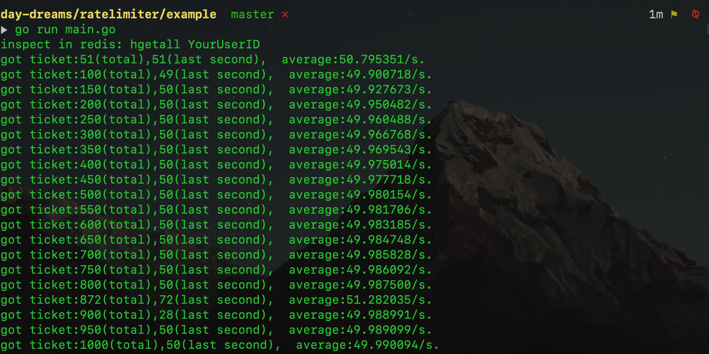

# ratelimiter

A distributed rate limiter, based on redis/lua and token-bucket algorithm.

[see usage example](./example/main.go)

```golang

    import 	(
        "github.com/go-redis/redis"
        "github.com/day-dreams/ratelimiter"
    )

    // initialize a ratelimiter by redis client
    client := redis.NewClient(&redis.Options{Addr: "127.0.0.1:6379"})
    limiter, err := ratelimiter.New(client, 50, 50, 10)
    if err != nil {
        panic(err)
    }
    // try to get 5 tickets
    ok, err := limiter.Get(context.TODO(), "YourUserID", 5)
    if err == nil && ok {
        fmt.Printf("you got your ticket!\n")
    }
```



